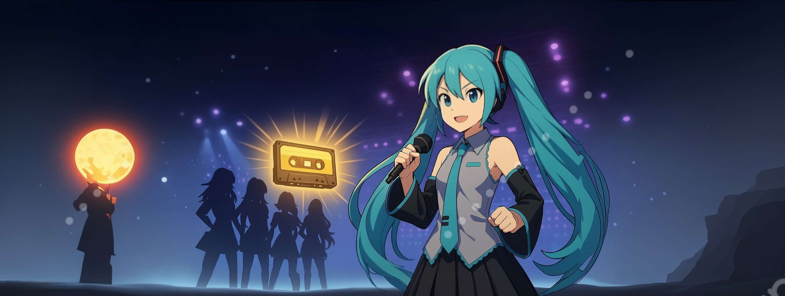

# 🎮 Hatsune Miku et la Cassette Légendaire — Projet RED (CLI en Go)

<!-- Banner / Logo principal -->
<!-- TODO: Remplacer par votre bannière -->



> Mini‑jeu **tour par tour** en **ligne de commande (Go)**, inspiré par un univers musical où un label tout‑puissant a volé la **Cassette Légendaire**. Récupérez‑la avec **Hatsune Miku**, débloquez **Kaaris**, **Macron**, **Michael Jackson**, et brisez le cartel **Pouler.fr**.

---

## 🧭 Sommaire

* [Pitch](#-pitch)
* [Aperçu (captures & schémas)](#-aperçu-captures--schémas)
* [Mécaniques clés](#-mécaniques-clés)
* [Fonctionnalités techniques](#-fonctionnalités-techniques)
* [Installation](#-installation)
* [Lancement](#-lancement)
* [Structure du dépôt](#-structure-du-dépôt)
* [Extraits de code intéressants](#-extraits-de-code-intéressants)
* [Roadmap](#-roadmap)
* [Crédits & Licence](#-crédits--licence)

---

## 🎤 Pitch

> **Pouler.fr** contrôle 90 % du PIB mondial de la musique et a volé la **Cassette Légendaire**. **Hatsune Miku** doit vaincre 4 rivales, réussir des épreuves (rythme, quiz, combat), et s’allier à **Kaaris**, **Macron** et **Michael Jackson** pour restaurer la vraie musique.

Pour le lore complet, voir **docs/** → *Bible d’univers*.

---

## 👀 Aperçu (captures & schémas)

<!-- TODO: Remplacer par vos images réelles de terminal / schémas -->

### Menu principal (mock)


### Combat tour par tour (mock)


### Schéma de progression


### Craft & Items (diagramme)


---

## 🧩 Mécaniques clés

* **Système de mise** : pariez des points avant chaque combat → **victoire : mise x2**, **défaite : mise perdue**. Les points gagnés réduisent le coût des équipements / rendent certaines attaques moins coûteuses / boostent leur puissance.
* **Disques empoisonnés** : combinez **matériaux + potion empoisonnée** pour créer des **disques** infligeant des **dégâts bonus contextuels** (selon la sensibilité des ennemis/boss).
* **Déblocage de personnages** :

  * *Michael Jackson* (mini‑jeu de rythme),
  * *Kaaris* (épreuve de combat),
  * *Macron* (quiz historique).
    Chacun apporte une **compétence signature**.
* **Craft & Équipement** : costumes de scène (chapeau/tunique/bottes) → **PV max +10/+25/+15**.
* **Économie** : marchand (disquaire), forgeron (ingé son), inventaire limité **10** (extensible).

---

## 🛠️ Fonctionnalités techniques

* **CLI Go** : menus lisibles, messages de combat standardisés.
* **Combat** :

  * Entraînement vs *Hater* (gobelin rethématisé) : 5 dégâts par tour, **crit x2** tous les 3 tours.
  * Menu combat : **Attaquer / Inventaire / (Fuite entraînement)**.
  * **Initiative** : qui commence selon l’attribut *initiative*.
* **Ressources** : PV / Mana (*énergie scénique*), **potion de mana** pour +20.
* **Sorts** : `Coup de poing (8)` et `Note explosive (18, coûte mana)`.
* **XP = notoriété** : montée de niveau → +5 PV max, recharge énergie.
* **isDead** : résurrection à **50 % PV** grâce aux fans.

> 🔎 Détails complets : **docs/** → *Bible d’univers*.

---

## ⚙️ Installation

> Prérequis : **Go 1.21+**

```bash
# 1) Cloner le dépôt
git clone https://github.com/PryXouh/projet-red_HatsuneWorld
cd projet-red_HatsuneWorld

# 2) Initialiser les dépendances (si besoin)
go mod tidy
```

> <!-- TODO: Lister ici les packages utilisés si vous en ajoutez -->

---

## ▶️ Lancement

```bash
# Exécuter
go run ./src

# Compiler puis exécuter
go build -o red-cli ./src
./red-cli
```

**Astuce** : ajoutez `-race` lors du run pour détecter d’éventuelles conditions de concurrence (utile si vous gérez des timers de poison via goroutines).

---

## 🗂️ Structure du dépôt

```
projet-projet-red_HatsuneWorld/
├─ src/                        # Code du jeu
│  ├─ main.go                  # Entrée du programme
│  ├─ character/               # Structures & init perso
│  ├─ inventory/               # Inventaire, items, limites
│  ├─ shop/                    # Marchand (disquaire), achats
│  ├─ forge/                   # Ingé son (craft équipements/disques)
│  ├─ combat/                  # Boucle, initiative, pattern ennemis
│  └─ utils/                   # Helpers (I/O, validation nom, etc.)
├─ docs/
│  ├─ bible_univers.md         # **Notre Bible verrouillée** ✅
│  ├─ images/                  # Captures & schémas (placeholders)
│  └─ presentation.pdf         # Slides orales (optionnel)
├─ README.md                   # Cette page
└─ LICENSE                     # Licence (optionnelle)
```

---

## 🔍 Extraits de code intéressants

> **Sections prêtes à être remplacées** par vos blocs de code (copiez/collez) :

### 1) Système de mise (betting)

```go
// TODO: Coller ici l’extrait de la fonction d’avant-combat
// func AskBet(...), calcule gain/perte, maj points de mise
```

### 2) Disques empoisonnés (craft + effet ciblé)

```go
// TODO: Coller ici la logique de craft et la table des faiblesses
// map[EnemyType]Weakness, ApplyPoisonedDisc(...)
```

### 3) Pattern de l’ennemi d’entraînement

```go
// TODO: Coller ici goblinPattern-like (5 dmg / tour, x2 tous les 3)
```

### 4) Initiative & boucle de combat

```go
// TODO: Coller ici l’ordre de jeu et la boucle
```

### 5) Messages standardisés

```go
// TODO: Coller ici les helpers d’affichage combat & erreurs marchand/forge
```

---

## 🧱 Roadmap

* [x] Bible d’univers verrouillée
* [x] Design mécaniques (mise, disques, déblocage persos)
* [ ] Sprint 1 — Bases (menu, inventaire, potions, marchand)
* [ ] Sprint 2 — Éco & craft (forge, recettes, upgrades inventaire)
* [ ] Sprint 3 — Combat (pattern hater, initiative, sorts)
* [ ] Sprint 4 — Progression (déblocage persos, XP, système de mise)
* [ ] Polish — Textes, équilibrage, QA, présentation orale

---

## 👥 Crédits & Licence

* **Équipe** : <!-- TODO: Noms + rôles -->
* **Encadrement** : Ynov — Ymmersion
* **Licence** : <!-- TODO: MIT / Apache-2.0 / autre -->

> ⚠️ Les noms de personnes publiques sont utilisés à des fins parodiques/pédagogiques dans le cadre d’un projet étudiant CLI.
